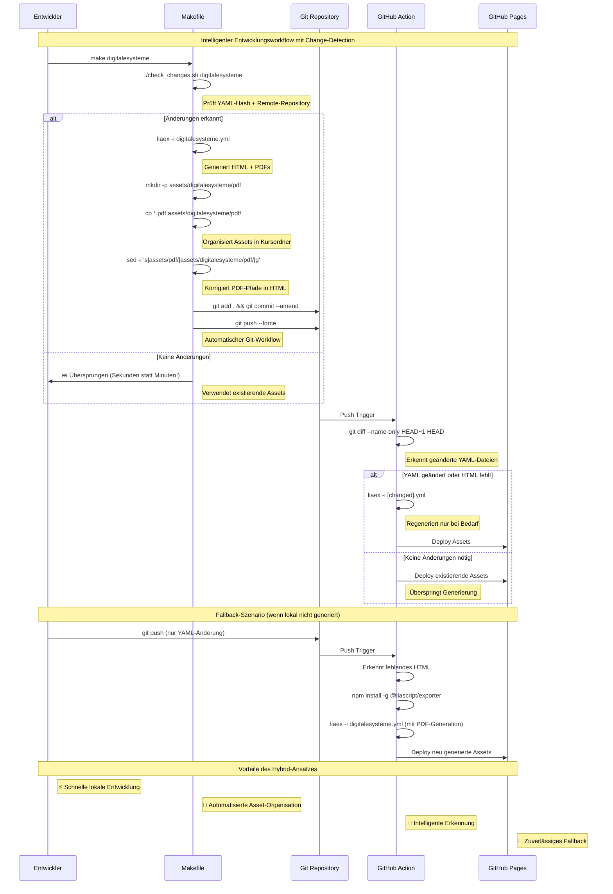

# TUBAF-IfI-LiaScript.github.io

Course-Overview der Arbeitsgruppe Softwareentwicklung und Robotik (TU Freiberg)

## Intelligente Asset-Generierung mit Change-Detection

Die Kurs-Assets werden lokal generiert mit einem intelligenten Change-Detection-System, das sowohl lokale YAML-Änderungen als auch Remote-Repository-Updates überwacht. Das System nutzt ein optimiertes Makefile für die lokale Entwicklung und eine schlanke GitHub Action als Fallback.



## Verfügbare Make-Targets

```bash
# Intelligente Kurs-Generierung (mit Change-Detection)
make digitalesysteme    # ⚡ Überspringt wenn keine Änderungen
make prozprog          # ⚡ Überspringt wenn keine Änderungen  
make softwareentwicklung  # ⚡ Überspringt wenn keine Änderungen
make robotikprojekt    # ⚡ Überspringt wenn keine Änderungen
make index            # Übersichtsseite (keine Remote-Überwachung)

# Alle Kurse mit Change-Detection
make all              # Nur geänderte Kurse werden regeneriert

# Erzwungene Neugenerierung (ignoriert Cache)
make force-build-digitalesysteme  # Einzelner Kurs
make force-all                    # Alle Kurse

# Utility-Befehle
make status           # Zeigt Build-Status und Cache-Informationen
make clean-cache      # Löscht Cache → nächster Build regeneriert alles
make clean-all        # Löscht alle generierten Dateien
make help            # Zeigt alle verfügbaren Targets
```

## Konfiguration

Das Makefile ist zentral konfiguriert:

```makefile
# Kurse mit PDF-Generierung
PDF_COURSES = digitalesysteme prozprog softwareentwicklung robotikprojekt

# SCORM-Parameter
SCORM_ORG = "TU-Bergakademie Freiberg"
SCORM_SCORE = 80
```

## Ordnerstruktur

```
├── digitalesysteme.yml     # Kurskonfiguration
├── digitalesysteme.html    # Generierte Webseite
├── check_changes.sh        # 🆕 Intelligente Change-Detection
├── .cache/                 # 🆕 Cache für Change-Detection
│   └── digitalesysteme     # Hash-Cache (YAML + Remote)
├── assets/
│   └── digitalesysteme/
│       └── pdf/           # Kurs-spezifische PDFs
│           ├── 272cfe0.pdf
│           ├── 0611ae484.pdf
│           └── ...        # 16 PDFs insgesamt
├── Makefile               # 🔄 Verbessertes Build-System
├── .gitignore            # 🆕 Ignoriert .cache/ Verzeichnis
└── .github/workflows/
    └── generateOERoverview.yml  # Optimierte GitHub Action
```

## Intelligentes Change-Detection-System

### 🔍 **Was wird überwacht:**
- **📄 Lokale YAML-Dateien**: SHA256-Hash der Konfiguration
- **🌐 Remote GitHub-Repositories**: Commit-Hash via GitHub API
  - `digitalesysteme` → `VL_EingebetteteSysteme`
  - `prozprog` → `VL_ProzeduraleProgrammierung`
  - `softwareentwicklung` → `VL_Softwareentwicklung`
  - `robotikprojekt` → `VL_Robotikprojekt`
- **📁 Generierte HTML-Dateien**: Existenz-Check

### ⚡ **Performance-Optimierung:**
- **Sekunden statt Minuten** bei unveränderten Inhalten
- Automatisches **Überspringen** bei identischen Hashes
- **Selective Rebuilds** nur bei tatsächlichen Änderungen

### 🛠️ **Entwicklungsworkflow:**

1. **Status prüfen**: `make status`
   ```
   📚 Course: digitalesysteme
     ✅ HTML file exists
     📋 Cache file exists  
     💾 Cached YAML: bd241dd6...
     💾 Cached remote: 5caf909b...
     📁 Assets: 16 PDFs
     🌐 Monitoring: VL_EingebetteteSysteme
   ```

2. **Intelligente Entwicklung**: `make digitalesysteme`
   - ✅ **Änderung erkannt** → Vollständige Regenerierung (HTML + PDFs + Git)
   - ⏭️ **Keine Änderung** → Überspringt Build (< 5 Sekunden)

3. **Automatischer Git-Workflow** (nur bei Änderungen):
   - `git add .` und `git commit --amend` 
   - `git push --force` für saubere History

## Technische Implementierung

### 🧠 **Change-Detection-Script** (`check_changes.sh`)
```bash
# Prüft lokale YAML-Änderungen
YAML_HASH=$(sha256sum digitalesysteme.yml | cut -d' ' -f1)

# Überwacht Remote-Repository via GitHub API
REMOTE_HASH=$(curl -s "https://api.github.com/repos/TUBAF-IfI-LiaScript/VL_EingebetteteSysteme/commits/master" | jq -r '.sha')

# Vergleicht mit Cache
if [ "$YAML_HASH" != "$CACHED_YAML" ] || [ "$REMOTE_HASH" != "$CACHED_REMOTE" ]; then
    echo "✅ Changes detected - rebuild needed"
    # Update cache and trigger rebuild
else
    echo "⏭️ No changes detected - skipping"
fi
```

### 📋 **Cache-System**
- **Speicherort**: `.cache/[course]` (ignoriert von Git)
- **Format**: Zeile 1 = YAML-Hash, Zeile 2 = Remote-Hash
- **Invalidierung**: Automatisch bei erkannten Änderungen

### 🔄 **Rebuild-Trigger**
- ✅ **YAML-Datei geändert** → Lokale Konfiguration aktualisiert
- ✅ **Remote-Repository aktualisiert** → Neue Markdown-Inhalte verfügbar  
- ✅ **HTML-Datei fehlt** → Erste Generierung oder Datei gelöscht
- ⏭️ **Alles unverändert** → Skip (massive Zeitersparnis)

## Troubleshooting & Tipps

### 🔧 **Häufige Szenarien:**

```bash
# Erzwungene Neugenerierung (ignoriert Cache)
make force-build-digitalesysteme

# Cache zurücksetzen (nächster Build regeneriert alles)
make clean-cache

# Vollständige Neugenerierung aller Kurse
make force-all

# Status aller Kurse anzeigen
make status
```

### 🌐 **Remote-Repository-Updates:**
Das System erkennt automatisch neue Commits in den überwachten Repositories:
- Neue Markdown-Inhalte werden automatisch bei `make digitalesysteme` gezogen
- PDF-Dateinamen bleiben bei unverändertem Inhalt identisch
- Remote-Verbindungsfehler → System nutzt cached Version

### 📊 **Performance-Metriken:**
- **Mit Änderungen**: ~3-5 Minuten (komplette PDF-Generierung)
- **Ohne Änderungen**: ~3-5 Sekunden (Change-Detection + Skip)
- **Überwachte Repositories**: 4 aktive + 1 index (nur lokal)
