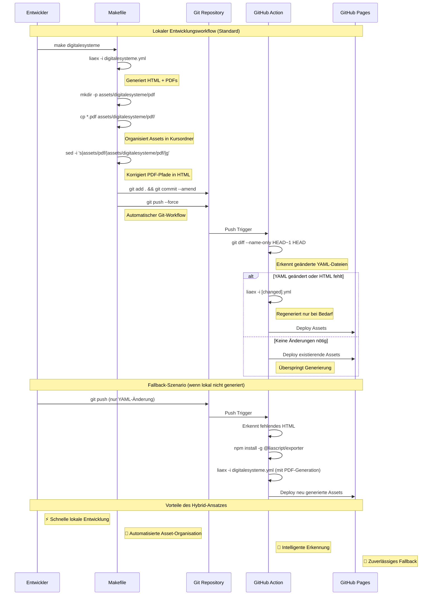

# TUBAF-IfI-LiaScript.github.io

Course-Overview der Arbeitsgruppe Softwareentwicklung und Robotik (TU Freiberg)

## Asset-Generierung und Deployment

Die Kurs-Assets werden lokal generiert und intelligent deployed. Der Ablauf nutzt ein optimiertes Makefile für die lokale Entwicklung und eine schlanke GitHub Action als Fallback.



## Verfügbare Make-Targets

```bash
# Einzelne Kurse generieren
make digitalesysteme    # Digitale Systeme / Eingebettete Systeme
make prozprog          # Prozedurale Programmierung
make softwareentwicklung  # Softwareentwicklung
make robotikprojekt    # Robotikprojekt
make index            # Übersichtsseite

# Alle Kurse
make all

# Hilfe anzeigen
make help
```

## Konfiguration

Das Makefile ist zentral konfiguriert:

```makefile
# Kurse mit PDF-Generierung
PDF_COURSES = digitalesysteme prozprog softwareentwicklung robotikprojekt

# SCORM-Parameter
SCORM_ORG = "TU-Bergakademie Freiberg"
SCORM_SCORE = 80
```

## Ordnerstruktur

```
├── digitalesysteme.yml     # Kurskonfiguration
├── digitalesysteme.html    # Generierte Webseite
├── assets/
│   └── digitalesysteme/
│       └── pdf/           # Kurs-spezifische PDFs
│           ├── 070f8b44f.pdf
│           └── ...
├── Makefile               # Build-System
└── .github/workflows/
    └── generateOERoverview.yml  # Intelligente GitHub Action
```

## Entwicklungsworkflow

1. **Lokal entwickeln**: `make digitalesysteme`
   - Generiert HTML und PDFs
   - Organisiert Assets automatisch
   - Korrigiert Pfade in HTML-Dateien

2. **Automatischer Git-Workflow**:
   - `git add .` und `git commit --amend` 
   - `git push --force` für saubere History

3. **Intelligentes Deployment**:
   - GitHub Action erkennt Änderungen
   - Regeneriert nur bei Bedarf
   - Fungiert als zuverlässiges Fallback
