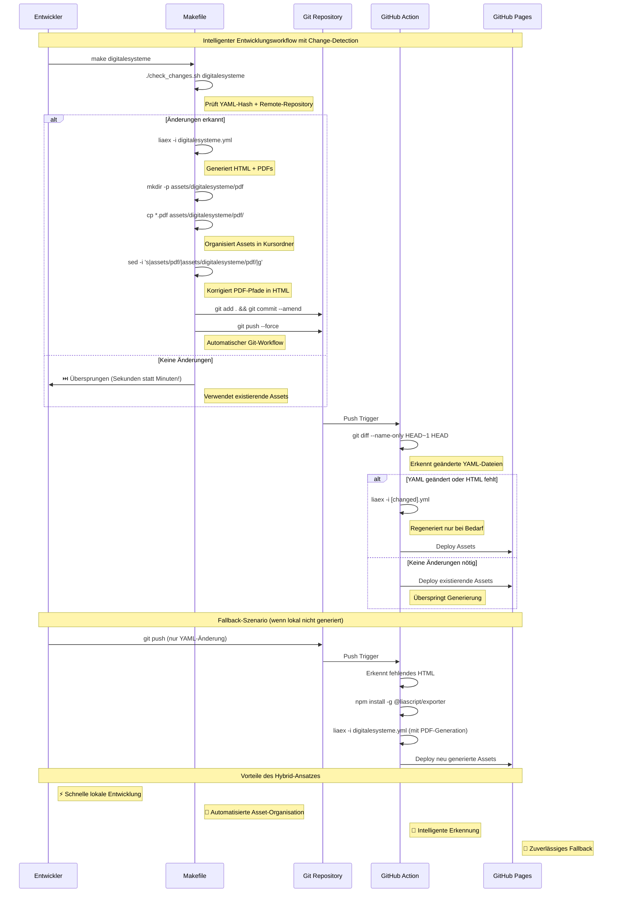

# TUBAF-IfI-LiaScript.github.io

Course-Overview der Arbeitsgruppe Softwareentwicklung und Robotik (TU Freiberg)

## Intelligente Asset-Generierung mit Change-Detection

Die Kurs-Assets werden lokal generiert mit einem intelligenten Change-Detection-System, das sowohl lokale YAML-Änderungen als auch Remote-Repository-Updates überwacht. Das System nutzt ein optimiertes Makefile für die lokale Entwicklung und eine schlanke GitHub Action als Fallback.


```mermaid
sequenceDiagram
    participant Dev as Entwickler
    participant Make as Makefile
    participant Git as Git Repository  
    participant Action as GitHub Action
    participant Pages as GitHub Pages

    Note over Dev,Pages: Intelligenter Entwicklungsworkflow mit Change-Detection
    
    Dev->>Make: make digitalesysteme
    Make->>Make: ./check_changes.sh digitalesysteme
    Note right of Make: Prüft YAML-Hash + Remote-Repository
    
    alt Änderungen erkannt
        Make->>Make: liaex -i digitalesysteme.yml
        Note right of Make: Generiert HTML + PDFs
        Make->>Make: mkdir -p assets/digitalesysteme/pdf
        Make->>Make: cp *.pdf assets/digitalesysteme/pdf/
        Note right of Make: Organisiert Assets in Kursordner
        Make->>Make: sed -i 's|assets/pdf/|assets/digitalesysteme/pdf/|g'
        Note right of Make: Korrigiert PDF-Pfade in HTML
        Make->>Git: git add . && git commit --amend
        Make->>Git: git push --force
        Note right of Make: Automatischer Git-Workflow
    else Keine Änderungen
        Make->>Dev: ⏭️ Übersprungen (Sekunden statt Minuten!)
        Note right of Make: Verwendet existierende Assets
    end
    
    Git->>Action: Push Trigger
    Action->>Action: git diff --name-only HEAD~1 HEAD
    Note right of Action: Erkennt geänderte YAML-Dateien
    
    alt YAML geändert oder HTML fehlt
        Action->>Action: liaex -i [changed].yml
        Note right of Action: Regeneriert nur bei Bedarf
        Action->>Pages: Deploy Assets
    else Keine Änderungen nötig
        Action->>Pages: Deploy existierende Assets
        Note right of Action: Überspringt Generierung
    end
    
    Note over Dev,Pages: Fallback-Szenario (wenn lokal nicht generiert)
    
    Dev->>Git: git push (nur YAML-Änderung)
    Git->>Action: Push Trigger
    Action->>Action: Erkennt fehlendes HTML
    Action->>Action: npm install -g @liascript/exporter
    Action->>Action: liaex -i digitalesysteme.yml (mit PDF-Generation)
    Action->>Pages: Deploy neu generierte Assets
    
    Note over Dev,Pages: Vorteile des Hybrid-Ansatzes
    Note right of Dev: ⚡ Schnelle lokale Entwicklung
    Note right of Make: 🎯 Automatisierte Asset-Organisation  
    Note right of Action: 🧠 Intelligente Erkennung
    Note right of Pages: 🔄 Zuverlässiges Fallback
```

## Verfügbare Make-Targets

```bash
# Intelligente Kurs-Generierung (mit Change-Detection)
make digitalesysteme    # ⚡ Überspringt wenn keine Änderungen
make prozprog          # ⚡ Überspringt wenn keine Änderungen  
make softwareentwicklung  # ⚡ Überspringt wenn keine Änderungen
make robotikprojekt    # ⚡ Überspringt wenn keine Änderungen
make index            # Übersichtsseite (keine Remote-Überwachung)

# Alle Kurse mit Change-Detection
make all              # Nur geänderte Kurse werden regeneriert

# Erzwungene Neugenerierung (ignoriert Cache)
make force-build-digitalesysteme  # Einzelner Kurs
make force-all                    # Alle Kurse

# Utility-Befehle
make status           # Zeigt Build-Status und Cache-Informationen
make clean-cache      # Löscht Cache → nächster Build regeneriert alles
make clean-all        # Löscht alle generierten Dateien
make help            # Zeigt alle verfügbaren Targets
```

## Konfiguration

Das Makefile ist zentral konfiguriert:

```makefile
# Kurse mit PDF-Generierung
PDF_COURSES = digitalesysteme prozprog softwareentwicklung robotikprojekt

# SCORM-Parameter
SCORM_ORG = "TU-Bergakademie Freiberg"
SCORM_SCORE = 80
```

## Ordnerstruktur

```
├── digitalesysteme.yml     # Kurskonfiguration
├── digitalesysteme.html    # Generierte Webseite
├── scripts/
│   ├── check_changes.sh    # Intelligente Change-Detection (Makefile)
│   ├── detect_changes.sh   # Änderungserkennung (GitHub Action)
│   ├── courses.conf        # Kurs → Upstream-Repo Mapping
│   ├── courses_lib.sh      # Shared library für courses.conf lookups
│   ├── generate_courses.sh # GitHub-Action: Kurs-Generierung
│   ├── prune_pdfs.sh       # Entfernt unreferenzierte PDFs
│   └── deployment_summary.sh # GitHub-Action: Deployment-Zusammenfassung
├── tests/
│   ├── run_tests.sh        # Test-Runner (alle Tests ausführen)
│   ├── lib/
│   │   └── test_lib.sh     # Gemeinsame Test-Hilfsfunktionen
│   ├── test_check_changes.sh  # Tests für check_changes.sh
│   └── test_detect_changes.sh # Tests für detect_changes.sh
├── .cache/                 # Cache für Change-Detection (von Git ignoriert)
│   └── digitalesysteme     # Hash-Cache (YAML + Remote)
├── assets/
│   └── digitalesysteme/
│       └── pdf/           # Kurs-spezifische PDFs
├── Makefile               # Build-System
├── .gitignore
└── .github/workflows/
    └── generateOERoverview.yml  # GitHub Action
```

## Intelligentes Change-Detection-System

### 🔍 **Was wird überwacht:**
- **📄 Lokale YAML-Dateien**: SHA256-Hash der Konfiguration
- **🌐 Remote GitHub-Repositories**: Commit-Hash via GitHub API
  - `digitalesysteme` → `VL_EingebetteteSysteme`
  - `prozprog` → `VL_ProzeduraleProgrammierung`
  - `softwareentwicklung` → `VL_Softwareentwicklung`
  - `robotikprojekt` → `VL_Robotikprojekt`
- **📁 Generierte HTML-Dateien**: Existenz-Check

### ⚡ **Performance-Optimierung:**
- **Sekunden statt Minuten** bei unveränderten Inhalten
- Automatisches **Überspringen** bei identischen Hashes
- **Selective Rebuilds** nur bei tatsächlichen Änderungen

### 🛠️ **Entwicklungsworkflow:**

1. **Status prüfen**: `make status`
   ```
   📚 Course: digitalesysteme
     ✅ HTML file exists
     📋 Cache file exists  
     💾 Cached YAML: bd241dd6...
     💾 Cached remote: 5caf909b...
     📁 Assets: 16 PDFs
     🌐 Monitoring: VL_EingebetteteSysteme
   ```

2. **Intelligente Entwicklung**: `make digitalesysteme`
   - ✅ **Änderung erkannt** → Vollständige Regenerierung (HTML + PDFs + Git)
   - ⏭️ **Keine Änderung** → Überspringt Build (< 5 Sekunden)

3. **Automatischer Git-Workflow** (nur bei Änderungen):
   - `git add .` und `git commit --amend` 
   - `git push --force` für saubere History

## Technische Implementierung

### 🧠 **Change-Detection-Script** (`scripts/check_changes.sh`)
```bash
# Prüft lokale YAML-Änderungen
YAML_HASH=$(sha256sum digitalesysteme.yml | cut -d' ' -f1)

# Überwacht Remote-Repository via GitHub API
REMOTE_HASH=$(curl -s "https://api.github.com/repos/TUBAF-IfI-LiaScript/VL_EingebetteteSysteme/commits/master" | jq -r '.sha')

# Vergleicht mit Cache
if [ "$YAML_HASH" != "$CACHED_YAML" ] || [ "$REMOTE_HASH" != "$CACHED_REMOTE" ]; then
    echo "✅ Changes detected - rebuild needed"
    # Update cache and trigger rebuild
else
    echo "⏭️ No changes detected - skipping"
fi
```

### 📋 **Cache-System**
- **Speicherort**: `.cache/[course]` (ignoriert von Git)
- **Format**: Zeile 1 = YAML-Hash, Zeile 2 = Remote-Hash
- **Invalidierung**: Automatisch bei erkannten Änderungen

### 🔄 **Rebuild-Trigger**
- ✅ **YAML-Datei geändert** → Lokale Konfiguration aktualisiert
- ✅ **Remote-Repository aktualisiert** → Neue Markdown-Inhalte verfügbar  
- ✅ **HTML-Datei fehlt** → Erste Generierung oder Datei gelöscht
- ⏭️ **Alles unverändert** → Skip (massive Zeitersparnis)

## Troubleshooting & Tipps

### 🔧 **Häufige Szenarien:**

```bash
# Erzwungene Neugenerierung (ignoriert Cache)
make force-build-digitalesysteme

# Cache zurücksetzen (nächster Build regeneriert alles)
make clean-cache

# Vollständige Neugenerierung aller Kurse
make force-all

# Status aller Kurse anzeigen
make status
```

### 🌐 **Remote-Repository-Updates:**
Das System erkennt automatisch neue Commits in den überwachten Repositories:
- Neue Markdown-Inhalte werden automatisch bei `make digitalesysteme` gezogen
- PDF-Dateinamen bleiben bei unverändertem Inhalt identisch
- Remote-Verbindungsfehler → System nutzt cached Version

### 📊 **Performance-Metriken:**
- **Mit Änderungen**: ~3-5 Minuten (komplette PDF-Generierung)
- **Ohne Änderungen**: ~3-5 Sekunden (Change-Detection + Skip)
- **Überwachte Repositories**: 4 aktive + 1 index (nur lokal)

## Tests

Die Change-Detection-Logik ist durch eine dedizierte Test-Suite in `tests/` abgedeckt.

### ▶️ Tests ausführen

```bash
bash tests/run_tests.sh
```

### 📁 Test-Struktur

| Datei | Beschreibung |
|-------|-------------|
| `tests/run_tests.sh` | Führt alle Test-Dateien aus und gibt eine Gesamtzusammenfassung |
| `tests/lib/test_lib.sh` | Gemeinsame Hilfsfunktionen (`suite`, `pass`, `fail`, `assert_*`, …) |
| `tests/test_check_changes.sh` | Tests für `scripts/check_changes.sh` (Makefile-seitige Detection) |
| `tests/test_detect_changes.sh` | Tests für `scripts/detect_changes.sh` (GitHub-Action-seitige Detection) |

### 🧪 Testfälle für `check_changes.sh`

| Szenario | Erwartetes Verhalten |
|----------|----------------------|
| Kein Argument übergeben | Usage-Meldung, Exit ≠ 0 |
| YAML-Datei fehlt | Fehlermeldung, Exit ≠ 0 |
| Kein Cache, kein HTML | Exit 0 (Rebuild nötig) |
| Kein Cache, HTML vorhanden | Exit 0 (kein Cached-Hash → Rebuild) |
| Cache + HTML stimmen überein | Exit 1 (kein Rebuild, "No changes detected") |
| YAML-Hash geändert | Exit 0, Grund "YAML file changed" |
| Remote-Hash geändert | Exit 0, Grund "Remote repository changed" |
| HTML-Datei fehlt | Exit 0, Grund "HTML file missing" |
| Remote nicht erreichbar, sonst unverändert | Exit 1 (unreachable wird ignoriert) |
| Remote nicht erreichbar, YAML geändert | Exit 0 (Rebuild trotzdem ausgelöst) |
| Kurs ohne Remote-Mapping, aktuell | Exit 1 |
| Kurs ohne Remote-Mapping, YAML geändert | Exit 0 |

### 🧪 Testfälle für `detect_changes.sh`

| Szenario | Erwartetes Verhalten |
|----------|----------------------|
| Keine YAML-Änderungen, alle HTML vorhanden | `courses_to_generate` ist leer |
| YAML geändert (git diff) | Kurs erscheint in `courses_to_generate` |
| HTML-Datei fehlt | Kurs erscheint in `courses_to_generate` und `missing_html` |
| YAML geändert UND HTML fehlt | Kurs erscheint in beiden Outputs |
| `.github/workflows/*.yml` geändert | Workflow-Datei wird nicht als Kurs behandelt |
| Mehrere Kurse, nur einer geändert | Nur der geänderte Kurs wird regeneriert |
